## 功能元件之「Nav bar」介紹：

- Nav bar:

  - Logo：點擊顯示各縣市的當前天氣
  - Search bar：顯示全台各縣市的選單以及關鍵字篩選，點擊縣市名稱更新搜尋欄為選取縣市名稱並顯示 36 小時和當週天氣預報
  - 各縣市總覽：點擊顯示各縣市的當前天氣

- Nav bar DEMO video

  <video width="500" height="240" controls>
    <source src="image/Nav_bar_DEMO.mov" type="video/mp4">
  </video>

- Nav bar RWD

  - window width > 720px

    

  - window width < 720px

    

  - window width < 500px

    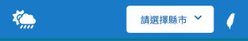

- 元件負責人員: 盧廷洋

## 功能元件之「異常天氣跑馬燈」介紹：

- 異常天氣跑馬燈:
  - 顯示中央氣象局所發布的關於今日異常天氣特報消息，提醒大家注意安全。
  - 如果該地區的異常天氣特報解除，跑馬燈的內容就會移除該地區、該事件、該特報的警示消息，讓使用者聚焦在當下需留意的危險情況。
  - 畫面呈現: 跑馬燈內容閃爍顯示，由視窗最右邊進入畫面，持續往左移動直到畫面最左邊，離開畫面，如此反覆循環。
- 關於異常天氣特報事件:
  - 事件種類分為濃霧、陸上強風、大雨、豪雨、大豪雨、超大豪雨這六類事件。
  - 資訊來源: [中央氣象局開放資料平臺提供的 API](https://opendata.cwb.gov.tw/dist/opendata-swagger.html)
- 畫面展示:

  - 有異常天氣特報事件時: 閃爍顯示有發布警示特報的地區，畫面呈現如下圖。

    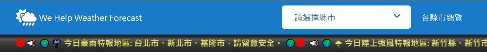
    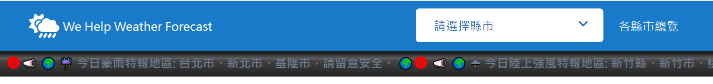

  - 沒有異常天氣特報事件時: 閃爍顯示問候祝福語，畫面呈現如下圖。

    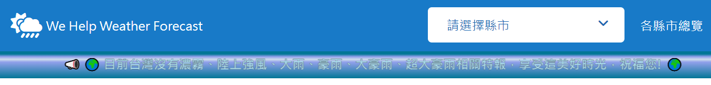
    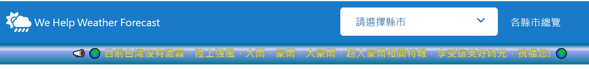

- 元件負責人員: 陳彥華

## 首頁 - 各縣市 36 小時天氣總覽：

- 功能：依據現在時間及 api 的氣象資料結束時間，判斷今明狀態，使用者點擊後，顯示對應的資料，滑鼠移至表格上方，出現陰影效果及 aria-lebel，提示使用者點擊後可觀看詳細資料。
  - 今明狀態：今日凌晨、今日白天、今晚明晨、明日白天、明日晚上。
  - 呈現項目：縣市名稱、天氣概況 icon、最低~最高溫(550 - 1000px 時隱藏)、降雨率。
- RWD
  - 1000px 以上：
    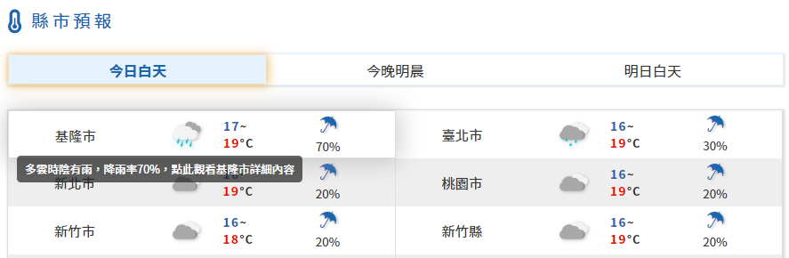
  - 550 - 1000px
    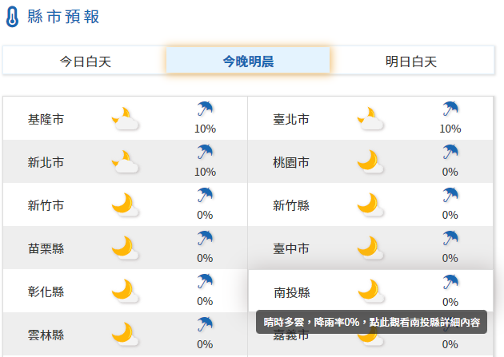
  - 550px 以下
    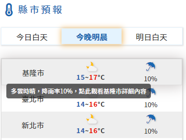
- 元件負責人員: 陳心渝

## 功能元件之「指定縣市-未來 36 小時天氣預報」介紹：

- 未來 36 小時天氣預報:
  - 根據中央氣象局所發布的關於未來 36 小時天氣預報，顯示「單一縣市」的天氣狀況、氣溫、降雨機率以及舒適度。
  - 配合使用者當下時間將動態更新標題，區塊標題將分別顯示為「今日白天、今晚明晨、明日白天」或是「今晚明晨、明日白天、明日晚上」等不同標題，讓使用者能更快獲取所需資訊。
- 畫面展示:

  - 當使用者當前時間為上午時刻：
    
  - 當使用者當前時間為晚間時刻：
    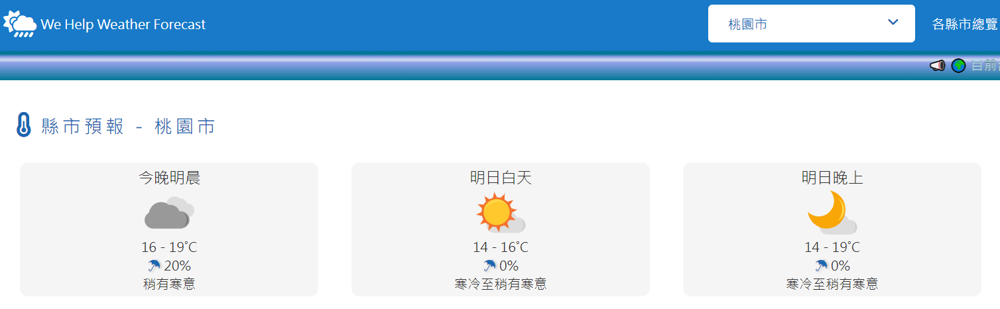

- 元件負責人員: 陳思安

## 功能元件之「指定縣市未來一週天氣預報」介紹：

- 指定縣市未來一週天氣預報表格:
  - 在使用者篩選指定縣市之後，畫面會呈現該地區未來一週的天氣預報
  - 未來的一週是指：篩選當日與未來六天，如果當天已超過中午 12 點時，則以隔天開始起算
  - 天氣預報內容包含：
    1. 白天的最高/最低溫度與天氣描述
    2. 晚上的最高/最低溫度與天氣描述
    3. 最高與最低的體感溫度
    4. 紫外線指標
- 資料來源: 中央氣象局開放資料平臺所提供的[「臺灣各鄉鎮市區未來 1 週天氣預報」API](https://opendata.cwb.gov.tw/dist/opendata-swagger.html#/%E9%A0%90%E5%A0%B1/get_v1_rest_datastore_F_D0047_091:~:text=%E8%87%BA%E7%81%A3%E5%90%84%E9%84%89%E9%8E%AE%E5%B8%82%E5%8D%80%E9%A0%90%E5%A0%B1%E8%B3%87%E6%96%99%2D%E8%87%BA%E7%81%A3%E5%90%84%E9%84%89%E9%8E%AE%E5%B8%82%E5%8D%80%E6%9C%AA%E4%BE%861%E9%80%B1%E5%A4%A9%E6%B0%A3%E9%A0%90%E5%A0%B1)
- 主要函式說明:
  |MVC|函式|功能|
  |---|---|---|
  |Model|getForecastData()|依據使用者所指定的縣市索取 API 資料|
  |Model|formData()|整理 API 所收到的資料|
  |View|formElement()|利用 formData()的資料，產生各個所需元素|
  |View|renderElement()|利用 formElement()的結果，將元素畫到網頁當中|
  |View|initializeOneWeekForecastElements()|初始化網頁元素，避免每次的篩選結果仍遺留在網頁上|
  |Control|renderResult()|控制各個函式的執行與運作|
- 畫面展示:

  - 完整資訊:  
    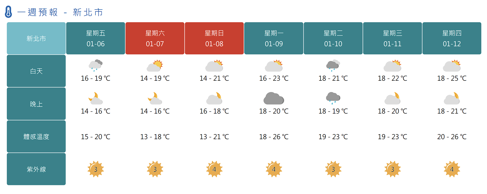

  - 部分資訊:  
    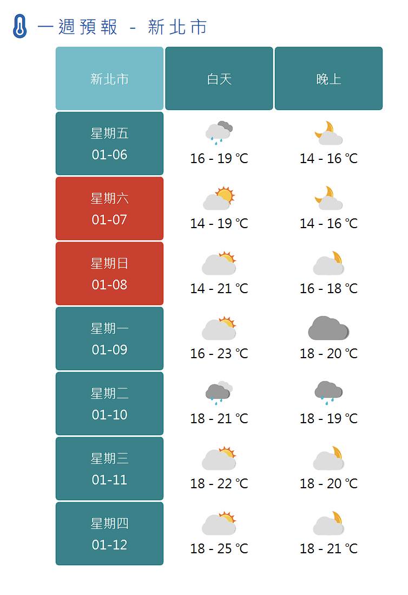

  - RWD:  
    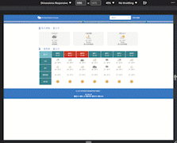

- 遇到的問題:

  - MVC: 第一次嘗試直接從 MVC 的架構出發，在思考函式的分工與範圍上應該有稍微上手一點點。
  - 整理 API 資料: 取出與整理成可以使用的資料，花了一些時間。
  - RWD: 利用 flex 解決行列互換的問題，後來偷偷看中央氣象局的寫法，則是更暴力地直接替換不同的表格。
  - 很感謝這次小小的團體活動，可以藉此機會和同學互相交流!

- 元件負責人員: 陳鴻銘

## 功能元件之「footer」介紹：

- footer:

  - copyright
  - 製作者社群：小組成員及 github link

    

- 元件負責人員: 盧廷洋
